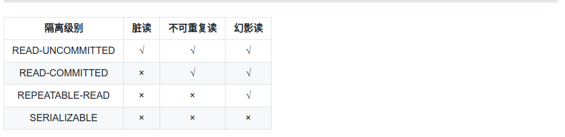

# 理解事务

## 数据库带来的并发问题

### 脏读（Dirty Read）

当事务 A 正在访问数据库中的某条记录，并且对记录做了修改，而这种修改还没有提交到数据库中。这时另外一个事务 B 也访问了这个数据，然后使用了这个数据。因为这个数据是没有提交的数据，如果事务 A 发生了回滚，那么另一个事务读到的数据就是脏数据，依据脏数据做出的操作可能是不正确的。由于事务 B 读取了脏数据，此种情况被成为脏读。

典型的例子就是转账事务和取款事务。假设小明有 3000 元，取款事务读取了该 3000，并且取走了 1000 但没有提交，转账事务读取到小明此时剩余 2000 块，并且转入 2000 元，将最后的结果修改成 4000 元。但实际上当取款事务由于错误发生回滚，转账事务由于读取的是脏数据，其结果是错误的。

### 不可重复读（Unrepeatable Read）

指在一个事务中多次读取同一条数据。在事务 A 还没有结束的时候，事务 B 更新了事务 A 读取到的记录，然后事务 A 再次的读取的时候发现读到的结果与上次读取的结果不一致。这就发生了一个事务内两次读取到的记录值不一致的问题，此种情况被成为不可重复读。

### 幻读（Phantom Read）

幻读与不可重复读有点类似。事务 A 在执行读取操作，需要两次统计行的数量，前一次查询到结果后，此时事务 B 插入或者删除了一些行并提交，此时事务 A 再次统计行的数量发现与第一次不再一致，此种情况被称为幻读。就像产生了幻觉一样，平白无故多了或者少了几条记录。

#### 不可重复读和幻读的区别

- 不可重复读是读取了其他事务更改的数据，针对的是 update 操作。

解决方案：使用行级锁，锁定该行，在执行完整个事务后才释放该锁，这时候允许其他事务更新。

- 幻读是读取了其他事务增加或者删除的数据，针对的是 insert 或者 delete 操作。

解决方案：使用表级锁，锁定整个表，在执行完整个事务后才释放锁。

为什么需要区分这两种读呢？因为解决方案不同，一个使用行级锁就能解决，一个得需要使用表级锁。

### 丢失修改（Lost to Modify）

丢失修改指的是，事务 A 在访问一条记录后，事务 B 也访问了该记录，事务 A 对其做了修改操作后提交，事务 B 也对其做了修改操作。这样事务 A 中的修改就被丢失了。例如，事务 A 中读取某表中的字段 age = 20，事务 B 也取到到 A = 20， 事务 A 中做 A = A - 1；事务 B 中也做 A = A -1，这样提交后的结果为 19，但事务 A 的修改丢失了，实际上结果应该是 18。

## 事务的四大特性

- 原子性（Atomicity）：一个事务中操作，要么全部完成，要不全部不完成，不会结束在某个中间环节。事务在执行过程中发生错误，会被回滚到事务开始前的状态，就像这个事务没执行过一样。即，事务不可分割，不可简约。

- 一致性（Consitency）：一个事务执行前和执行后都必须处于一致性状态。拿转账来说，假设用户 A 和用户 B 两者加起来的钱是 5000， 那么不管两人经历了多少次转账，事务结束后，两个用户的前加起来总和是不变的，这就是事务的一致性。

- 隔离性（Isolation）：一个事务未提交的结果是否对其他事务可见。级别一般有 read_uncommit，read_commit，read_repeatable，Serializable 串行化访问。会在后面详细介绍。

- 持久性（Durability）：一个事务一旦提交了，那么对数据的改变是持久化的，即便是数据库遇到系统故障的情况下也不会丢掉事务的操作。

## 事务的隔离级别

SQL 标准定义了四个隔离级别：

- READ-UNCOMMITTED（读取未提交）：最低的隔离级别，允许读取未提交的数据变更，可能会导致 **脏读**，**不可重复读**, **幻读**。

- READ-COMMITTED（读取已提交）：允许事务读取已提交的数据，可以阻止脏读，但是 **幻读**， **不可重复读** 仍然有可能发生。

- Repeatable READ（可重复读）：对同一字段的多次读取结果都是一致的，除非是数据被事务自己所修改，可以阻止 **脏读** 和 **不可重复读**，但是不能阻止 **幻读**，也就是加了行级锁（只有表级锁才能阻止幻读）。

- Serializable（串行化）：最高的隔离级别，完全服务 ACID 的约束。所有事务逐个一次进行，这样事务之间就不会产生任何干扰，也就是说，该级别可以阻止 **脏读**，**不可重复读** 和**幻读**。

### MySQL

MySQL InnoDB 默认使用了 REPEATABLE-READ（可重复的读）。我们可以通过`SELECT @@tx_isolation;` 命令来查看，MySQL 8.0 该命令改为 `SELECT @@transaction_isolation;`。

## 实际演示

参考[演示](https://github.com/Snailclimb/JavaGuide/blob/master/docs/database/%E4%BA%8B%E5%8A%A1%E9%9A%94%E7%A6%BB%E7%BA%A7%E5%88%AB(%E5%9B%BE%E6%96%87%E8%AF%A6%E8%A7%A3).md#%E5%AE%9E%E9%99%85%E6%83%85%E5%86%B5%E6%BC%94%E7%A4%BA)

## 参考

- [快速理解脏读、不可重复读、幻读](https://cloud.tencent.com/developer/article/1450773)
- [事务隔离级别](https://github.com/Snailclimb/JavaGuide/blob/master/docs/database/%E4%BA%8B%E5%8A%A1%E9%9A%94%E7%A6%BB%E7%BA%A7%E5%88%AB(%E5%9B%BE%E6%96%87%E8%AF%A6%E8%A7%A3).md)
