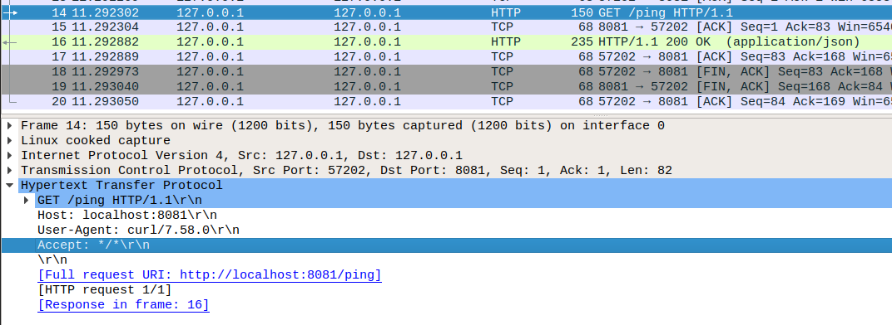
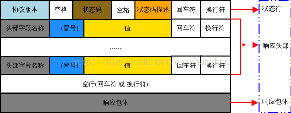
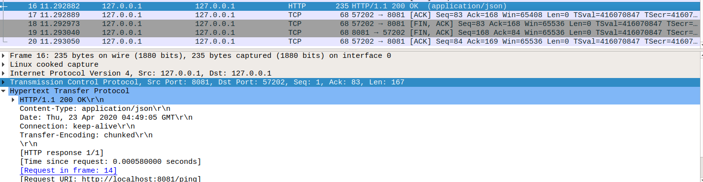
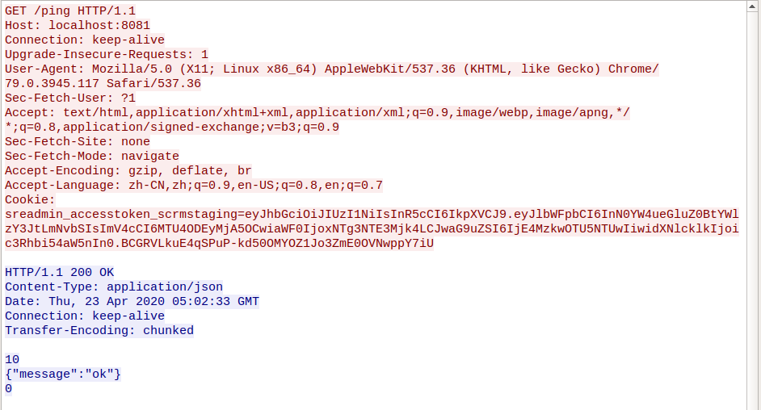

# HTTP 基础

HTTP（超文本传输协议）是构建在应用层的文本传输协议，基于 TCP/IP 协议栈。

## 无状态

在通信层面，http 每个请求都是完全独立的，每个请求包含了处理这个请求所需的完整的数据，发送请求不涉及到状态变更。即使在HTTP/1.1上，同一个连接允许传输多个HTTP请求的情况下，如果第一个请求出错了，后面的请求一般也能够继续处理（当然，如果导致协议解析失败、消息分片错误之类的自然是要除外的）。

### 参考

- [HTTP是一个无状态的协议。这句话里的无状态是什么意思](https://www.zhihu.com/question/23202402/answer/527748675)

## 请求数据包格式

HTTP 请求报文由请求行、请求头、空行和请求体 4 个部分组成，如下图所示：

下面是在 linux 下本地执行 `curl http://localhost:8081/ping` 的抓包结果，可以很清楚的与报文格式内容一一对应，注意从抓包的结果来看，最后的空行包含 `\r\n（回车符和换行符）` 两个字符，由于使用的 GET 请求，所以没有请求体。

## 响应数据包格式

HTTP 响应报文由状态行、响应头、空行和 响应体 4 个部分组成，如下图所示：

抓包结果如下，

响应体由于 wirshark 输出的样式不太友好，点击 TCP Stream 整体来看就是这样：

值得注意的是，在响应体的第一行是一个 `10`， 第二行是响应内容 `{"message":"ok"}`, 第三行是 `0`。实际上这是由于服务器的传输格式为 [Transfer-Encoding: chunked](https://blog.csdn.net/u014569188/article/details/78912469)导致的，服务端以流的形式返回数据，是没办法预先知道 `content-length` 的，所以会先发一个十六进制的值作为接下来要发送的内容的长度，比如这里发送的是 `10`， 转换成十进制为 16，也就是说接下来要发送 16 个字节。最后末尾发送一个 `0`，代表着服务端数据已经全部返回。

## 请求方法

## 响应码

- 401 （Unauthorized），实际上 401 表示未认证，也就是没有带认证信息或者认证信息错误，应该单词 `Unauthenticated` 的意思。
- 403 （Forbidden），资源请求被拒绝，一般是认证通过了，但是该用户没有访问改资源的权限，这里才应该用 `Unauthorized`。
- 499，nginx 独有的状态码，当客户端主动关闭了连接，nginx 会在 access log 中记录成 499。

### 参考

- [HTTP状态码401和403深度解析](https://juejin.im/post/5ad04750518825558b3e57bd)

## 清单

- [MDN HTTP](https://developer.mozilla.org/zh-CN/docs/Web/HTTP)