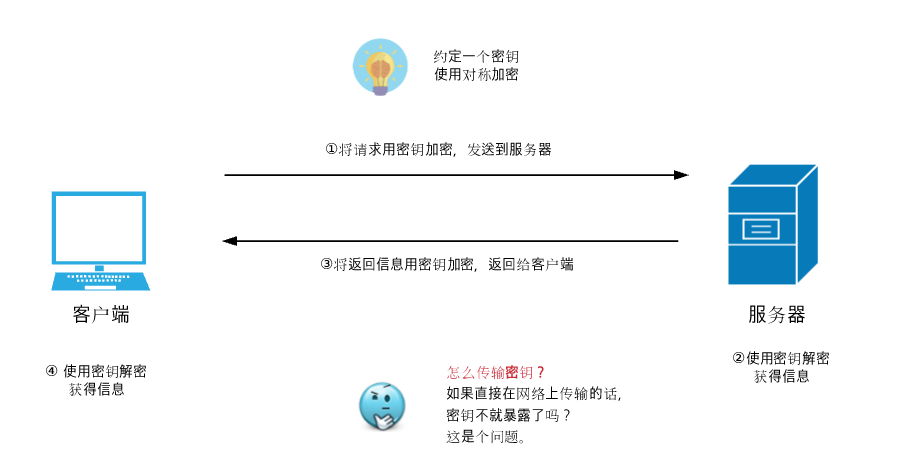
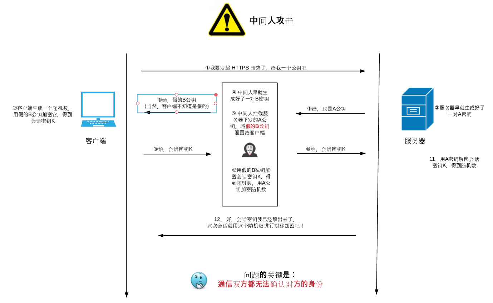
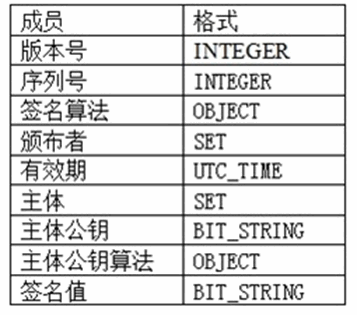
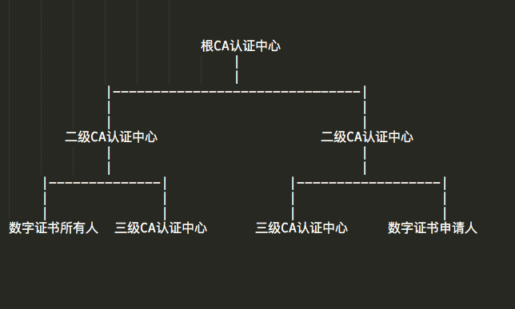

# HTTPS 原理

HTTPS (HyperText Transfer Protocol Over Secure Socket Layer): 可以理解为 HTTP + SSL/TLS 协议，即在 TCP 和 HTTP 层之间加入了 SSL 层。(属于ISO 七层模型的哪一层？)

## 为什么需要 HTTPS(HTTP 的不足之处)

- 通信内容使用明文——内容可能被窃听
- 无法验证报文的完整性——报文有可能已遭篡改
- 不验证通信方的身份——可能遭遇伪装

## 怎样解决上述问题

### 通信内容使用明文--加密

加密通信双方能使用密钥来加密和解密通信内容，从而避免在传输过程中内容暴露。主流的公开密钥加密（Public-key cryptography）算法是分为对称密钥加密算法和非对称密钥加密算法：

- 对称密钥加密算法：

加密和解密操作使用同一个密钥的算法称为对称密钥算法。比如双方约定，加密操作为向右移动 3 位，则 abc 加密后的结果就是 def，接收方只需要得到的结果向左移动 3 位即为解密后的内容，此时，移动 N 位中的 N 即为 密钥。但是这种方式在通信中有些缺点：比如，如何保证密钥在网络传输过程中不被截获。总不能和千万用户都私下约定好。

- 非对称密钥加密算法：

非对称密钥算法解决了上述问题，非对称密钥分为 2 个密钥，即公钥（public key）和私钥（private key）。私钥不能让任何人知道，公钥可以随意发布。因此，私钥只会被解密的那一方持有，公钥会被发送给加密的那一方。使用这种方式时，发送密文的那一方使用公钥机密通信内容，然后发送给服务器，服务器使用私钥解密数据。因此，这有服务端可以解密得到通信内容。

当然非对称密钥也不是没有缺点，比如它的速度慢。因此，真实的 HTTPS 通信过程两种算法都有同时用到,比如，在握手环节，约定一个随机字符串作为对称密钥，用非对称密钥来传输这个对称密钥来保证安全性。可以用下图理解:

### 无法验证报文的完整性--数字签名

数字签名是用来确保数据完整性的技术。数字签名一般使用的是 Hash 函数（单向加密算法），而且 Hash 函数是不可逆的，无法通过 Hash 值推测出原文，同时不同的 原文会产生不同的 Hash 结果。因此它可以证明报文来自谁，是否被篡改过。数字签名是附加在数据上的一段特殊的加密过的校验码。举个例子，当发送方使用服务器方的公钥发送了一段报文，黑客获取到了这部分报文，他们无法查看报文的内容（因为没有服务器方的私钥，但是他们可以篡改报文的内容，对其进行破坏），那么该如何识别这段信息有没有被篡改呢？答案是对报文内容进行数字签名，下面是一个数字签名在网络中的传输流程：

假设有节点 A 要向节点 B 发送一段报文：

- 节点 A 为要发送的报文使用 Hash 函数，生成摘要(digest)
- 节点 A 用自己的私钥对摘要进行加密，生成数字签名(signature)
- 节点 A 把数字签名附在要发送的报文之后，然后把报文和签名一块发送给节点 B
- 节点 B 收到报文后，先取出数字签名部分，用节点 A 的公钥解密得到摘要，如果成功解密，就说明信息是来自节点 A 的
- 节点 B 对报文部分生成摘要， 并且对与签名部分到的摘要进行比较，如果一致，则可以认为报文是未被篡改过的

### 不能验证通信方的身份--数字证书

上面利用公钥，私钥和数字签名基本可以保证了信息在传输过程中的私密性和完整性，但是还存在一个问题是，如何保证公钥的身份是真实的，不是被冒充的呢？这里有个著名的案例叫做中间人攻击，如下图所示：

为了保证公钥的真实性，引入了数字证书。数字证书是由一个官方权威机构签发的一组数据，用来识别通信双方的身份。X.509 定义了数字证书的标准。该标准指定了数字证书的所需信息以及用于发送这些信息的格式。X.509 是 X.500 系列标准的认证框架部分。

#### X.509 证书

一个标准的 X.509 数字证书包含以下一些内容：

- 证书的版本号
- 证书的序列号，每个证书都有一个唯一的证书序列号
- 证书所使用的签名算法
- 证书的发行机构名称，命名规则一般采用X.500格式
- 证书的有效期，现在通用的证书一般采用UTC时间格式，它的计时范围为1950-2049
- 证书主体的名称，命名规则一般采用X.500格式
- 证书主体的公钥信息
- 证书颁发者对证书的签名

将证书内容分类的话，其实可以分成两部分，证书主体部分（颁发者信息，主体信息），签名部分（签名值和签名算法）

#### 证书认证中心（CA）

数字证书不是谁都可以颁发的，必须是被信任的权威授权机构来负责发放和认证。而且证书认证中心不是只有一个或者一级，它是一个类似树结构的组织，来组成了一个完整的证书认证链。比如，根 CA 中心可以授权多个一级 CA 中心，一级CA中心可以授权二级CA 中心，然后二级 CA 中心为网站签名并发放数字证书。而且，根 CA 中心也可以有很多个。如下图所示：

其中每个 CA 中心都有自己的一个数字证书和公钥、私钥。这是由它们的父 CA 中心颁发给它们的。根 CA 中心是最高级别，因此如果根 CA 中心证书过期，则下面的所有子证书都不被信任，从而整个证书链就失效了。 所以，证书认证实际上是一个证书链的认证过程，只有整个链路都没问题，该证书才能够被信任。

#### 数字证书的完整认证流程

- 全世界有几个权威机构，它们受所有的浏览器厂商信任，这些机构组成了根 CA 证书认证中心。它们首先会使用非对称密钥算法生成一对公钥和私钥。
- 然后用自己的私钥为自己的公钥签发一个数字证书。该数字证书被各大浏览器厂商设置为了可信任的根证书。该数字证书包含了根 CA 的公钥信息和签名信息，而且该数字证书的签发者和被签发的主体都是该 CA 机构。（数字签名的逻辑可以参考第二小节）
- 这些 CA 机构底下又设置了一级 CA 机构，该一级 CA 也有一对密钥（公钥和私钥），根 CA 用自己的私钥为 一级 CA 签发了数字证书，让其具备可以为其他人签发证书的能力。该数字证书中保存了一级 CA 的公钥，而且颁发者为根 CA，被签发的主体为一级 CA。
- 一级 CA 又设置了二级 CA 机构，它也拥有独立的一对密钥，一级 CA 使用自己的私钥为二级 CA 签发了数字证书。该数字证书中保存了二级 CA 的公钥，颁发者为一级 CA，被签发的主体是二级 CA。
- 如果继续有下设机构的话，就按照如此链路往下。
- baidu 向该二级 CA 机构申请数字证书，并提供了公司的主体名称，域名，公钥等 x.509 需要的信息。二级 CA 通过签名算法对这些信息进行计算得到一个 Hash 值。然后使用自己的私钥对该 Hash 值进行加密，得到了签名信息，然后生成数字证书发送回 baidu（这里是要付钱的）。
- baidu 就可以用该数字证书开启 https 认证了。
- 当用户在浏览器里访问 https://www.baidu.com 的时候，首先建立 ssl 连接，baidu 服务器会向用户返回一个数字证书（明文传输，这些内容是内容是没有加密的）。
- 浏览器需要验证该证书是否有效，首先它会解析该证书的内容和签名信息。首先从受信任的根证书列表中寻找该证书中所记录的颁发者，如果能找到，则用根证书中的公钥对该签名信息进行解密得到证书公开内容的 Hash 值。然后用证书记录的签名算法当前公开内容计算其 Hash 值，并对二者进行比较，如果结果一致，说明证书是有效的。
- 还有一种情况是证书链的存在，由于浏览器只内置了全世界最权威的那几个机构，其下面的一级二级 CA 机构并不在其可信任的列表内，因此需要验证整个证书链才能证明该证书是有效的。这种情况下，一般在标准的证书中都会包含`颁发者名称`和`颁发者机构信息`，该信息会记录颁发者证书所在的 URL，浏览器会从该 URL 下载到颁发者的数字证书（例子中二级 CA 机构的证书），如果该证书的颁发者依旧不存在可信任的列表中，会继续从该证书中找到其颁发者机构信息，并从中再次下载证书（在例子中为一级 CA 机构的证书），由于该一级 CA 机构证书是由浏览器中可信任列表中的机构颁发的，因此用根 CA 证书中的公钥来解密 一级证书中的签名信息，得到 Hash 值做验证，如果验证通过，则证明一级 CA 证书是有效的，再通过一级 CA 中的公钥来解密二级 CA 的签名从而证明二级证书是有效的，然后再用二级CA 的公钥来解密 www.baidu.com 的数字证书，验证签名后得到真实的公钥信息，用来做后续的 https 通信。

整个流程中需要注意（可能会混淆）的地方:

- 公钥和私钥都可以做加密或者解密。
- 公钥和私钥既用在了数字证书的签名步骤中，也用在了浏览器和服务器传输双方约定对称加密的随机字符串的加密解密过程中。

### 浏览器对 web 服务器的身份认证过程

如下图所示：

### 参考文档

- [youngwind blog](https://github.com/youngwind/blog/issues/108)
- [数字签名是什么](http://www.ruanyifeng.com/blog/2011/08/what_is_a_digital_signature.html)
- [https 原理详解](http://liuduo.me/2018/05/14/https-detail/)
- [数字签名和数字证书究竟是什么？](https://zhuanlan.zhihu.com/p/34214759)
- [X.509数字证书的结构与解析](https://blog.csdn.net/xy010902100449/article/details/52145009)
- [数字证书与数字签名](https://www.jianshu.com/p/e767a4e9252e)
- [数字证书的原理是什么](https://www.zhihu.com/question/24294477)
