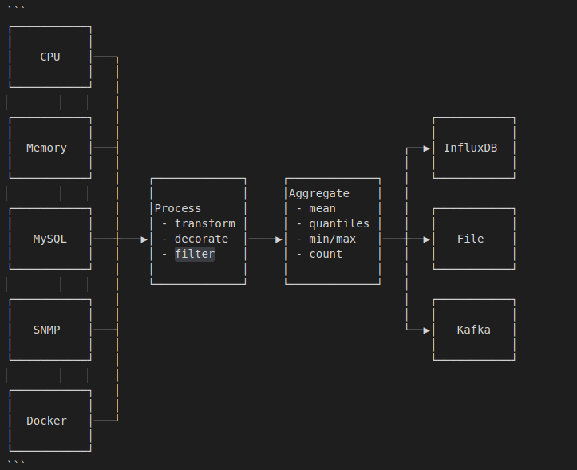

# Telegraf 源码阅读

[Telegraf](https://www.influxdata.com/time-series-platform/telegraf/) 是 influxData 公司开源的基于插件的数据收集和发送代理，是监控平台搭建中必不可少的一环。公司内部的监控平台的数据收集组件就使用了它，源于其插件化的可扩展性，非常适合自定义。本篇文章分享下 telegraf（版本 1.3） 内部的实现机制，从中确实学到了很多东西。

## 数据流向图

下面是 telegraf 处理数据的流程图，其插件一共分为四类，分别如下：

- inputs：输入插件，用于生成 metrics，inputs 插件有两类，分别需要实现 `telegraf.Input` 或 `telegraf.ServiceInput` 接口。
- processors：用于对数据的流式处理，processors 各插件之间按照顺序执行，需要实现 `telegraf.Processor` 接口。
- aggregators：用于对 period 时间内的数据做一些聚合处理，返回聚合后的结果给 output 端，需要实现 `telegraf.Aggregator` 接口。
- outputs：输出后端，比如 influxdb，文件等，对应 inputs，也分两种类型，分别需要实现 `telegraf.Output` 或 `telegraf.ServiceOutput` 接口。

其中，这四类插件全部支持 Filter，可以在任意阶段丢弃或添加字段，下面会详细介绍。



## 主函数处理流程

- 该项目的入口文件是 `cmd/telegraf.go`，在 `import` 阶段便做了一件非常重要的事情，那便是 import 各插件对应的 package 文件，以使得内部的 init 函数得以执行，从而将各插件在初始化的时候便注册到了相应的变量里，主要 import 代码如下：

    ```go
    import (
        ...
        _ "github.com/influxdata/telegraf/plugins/aggregators/all"
        _ "github.com/influxdata/telegraf/plugins/inputs/all"
        _ "github.com/influxdata/telegraf/plugins/outputs/all"
        _ "github.com/influxdata/telegraf/plugins/processors/all"
        ...
    )
    ```

    以 `import .../inputs/all` 为例分析：

    - 第一步，进入到 `plugins/inputs/all` 包中可以发现，里面导入了 inputs 目录下定义的所有插件包：

    ```go
    import (
        _ "github.com/influxdata/telegraf/plugins/inputs/aerospike"
        _ "github.com/influxdata/telegraf/plugins/inputs/amqp_consumer"
        _ "github.com/influxdata/telegraf/plugins/inputs/apache"
        ...
    ```

    - 随便找了一个具体的 inputs 文件夹下的包查看，例如 `plugins/inputs/apache"`,可以看到，内部定义了 init 函数，其中调用 `inputs.Add()` 方法将该插件的实例注册到了 `inputs.Inputs` map 中。从代码中可以看到，map 的 value 类型 `Creator` 是一个函数，返回 `telegraf.Input` 接口。显然，每一个自定义的 input 插件必须实现该接口，才能被框架所用。

    ```go
    // plugins/inputs/apache.go
    func init() {
	    inputs.Add("apache", func() telegraf.Input {
		    return &Apache{}
	    })
    }

    // plugins/inputs/registry.go
    package inputs

    type Creator func() telegraf.Input

    var Inputs = map[string]Creator{}

    func Add(name string, creator Creator) {
        Inputs[name] = creator
    }

    ```

    其余三类插件的初始化逻辑都是一样的，每个插件注册的 `Creator` 函数返回对应的接口类型。

- 当插件初始化完成后，进入 `main` 函数逻辑：
    - 第一步，`flag.Parse()`, 各 flag 参数的意义都很明确了，以 `fInputFilters` 为例，其定义了当程序运行时，启用的 input 插件名称，多个值以冒号隔开。

    ```go
    ...
    var fInputFilters = flag.String("input-filter", "", "filter the inputs to enable, separator is :")
    var fInputList = flag.Bool("input-list", false, "print available input plugins.")
    ...
    ```

    - 省略若干代码，接下来便进入到最重要的 `reloadLoop` 函数, 该函数接收命令行参数传入的插件信息，开始初始化和运行逻辑：

    ```go
    reloadLoop(stop chan struct{}, inputFilters []string, outputFilters []string, aggregatorFilters []string, processorFilters []string)
    ```

- `reloadLoop` 函数介绍，下面主要介绍函数里执行的主要流程：
    - 利用一个带缓冲的 channel 实现了 reload 机制，通过 SIGHUP 信号触发，实现逻辑还是比较简洁的，在进入 for 循环后，又执行了一次 `reload <- false` 是为了当 `ag.Run(shutdown)` 退出后整个 for 循环也正确退出；由于执行 `ag.Run(shutdown)` 会一直收集数据而阻塞，正常情况下 for 循环只会执行一次，收到 `SIGHUP` 信号后，先 `<-reload` 取出第二次设置的 false， 再 `close(shutdown)` 并设置 `reload <- true` 以便再次进入 for 循环，由此便实现了 reload 机制：

    ```go
    reload := make(chan bool, 1)
    reload <- true
    for <-reload {
        reload <- false
        // 省去无关代码
        signal.Notify(signals, os.Interrupt, syscall.SIGHUP)
        go func() {
            select {
            case sig := <-signals:
                if sig == os.Interrupt {
                    close(shutdown)
                }
                if sig == syscall.SIGHUP {
                    log.Printf("I! Reloading Telegraf config\n")
                    <-reload
                    reload <- true
                    close(shutdown)
                }
            case <-stop:
                close(shutdown)
            }
        }()
        // 省去无关代码
        ag.Run(shutdown)
    }
    ...
    ```

    - `c.LoadConfig(*fConfig)` 解析配置文件，初始化 config 结构体。该函数会传入配置文件的路径，解析配置项，telegraf 的配置文件采用的是 TOML 的语法。配置项里定义的每个插件都会调用其对应类型的 `add${type}` 方法去完成插件和参数的映射，在下面会具体介绍。

        ```go
        c := config.NewConfig()
        err := c.LoadConfig(*fConfig)
        ```

    - `ag := agent.NewAgent(c)` 初始化 agent 结构体。agent 可以理解成整个 telegraf 全局的代理，由它发起所有的操作。其结构体只保存了 config 字段。

        ```go
        type Agent struct {
            Config *config.Config
        }
        ```

    - `err = ag.Connect()` 从 `a.Config.Outputs` 中获取到所有的 ouptput 实例，然后调用其内部的 `Connect` 方法与后端进行连接，为收集 metrics 做准备。

    - `ag.Run(shutdown)` 运行主逻辑，开始收集，处理和发送 metrics，将重点介绍。

- `c.LoadConfig(*fConfig)` 介绍：该函数会加载所有插件的配置文件，处理方式大同小异，这里以 input 插件 docker 为例，假设在配置文件中定义的结构体如下：

    ```
    [[inputs.docker]]
    endpoint = "$DOCKER_ENDPOINT"
    ```

    - 在代码中，经过 toml 包的映射后，最重要的是调用 `c.addInput(name, value)` 方法，将插件以及插件的参数做初始化。

        - 先通过 name 从 `inputs.Input` 从找到注册的 `creator` 函数，调用它生成一个默认的 input 实例，该实例在这里用接口 `telegraf.Input` 存储。
            ```go
            creator, ok := inputs.Inputs[name]
            if !ok {
                return fmt.Errorf("Undefined but requested input: %s", name)
            }
            input := creator()
            ```
        - 类型断言 input 是否也实现了 `SetParser` 接口，如果实现了，先执行 `buildParser` 函数，用配置文件（最重要的参数是 `data_format`）填充 `parsers.Config{}` 对象 c，然后使用 `parsers.NewParser(c)` 根据构建 parser 实例，并执行 `SetParser(parser)` 将 parser 设置到 input 实例中，可以参考 inputs 插件中的 `tail`,实现了该接口。
        
            ```go
            switch t := input.(type) {
            case parsers.ParserInput:
                parser, err := buildParser(name, table)
                if err != nil {
                    return err
                }
                t.SetParser(parser)
            }
            ```
        - 调用 `buildInput` 函数，将解析 input 插件公共的配置参数，并设置到结构体中，返回一个 `pluginConfig` 实例，其类型为 `*models.InputConfig`。注意，这一步最后会执行 `buildFilter` 函数，所以，Filter 相关的参数也可以在配置文件中定义，在这一步一起解析出来。

            ```go
            type InputConfig struct {
                Name              string
                NameOverride      string
                MeasurementPrefix string
                MeasurementSuffix string
                Tags              map[string]string
                Filter            Filter
                Interval          time.Duration
            }
            ```

        - 接下来执行 `toml.UnmarshalTable(table, input)`， 将定义的插件结构体参数反射进 `telegraf.Input` 所存储的 input 实例中，完成 input 的初始化，这一步会覆盖掉 input 插件自身的默认值。自此可以明白，写一个 input 插件需要注意两类配置参数，一类是定义自身的参数，另一类是框架中已经定义好的公共参数，根据实际情况来使用完成自己的需求实现。

        - 最后一步执行 `models.NewRunningInput(input, pluginConfig)`，合并两类配置，返回最终形态的 input 运行时实例，结构体类型叫做 `*models.RunningInput`，并添加到 c.Inputs 中，这个数组中存了所有启用的 input 插件运行时实例。

            ```go
            type RunningInput struct {
                Input  telegraf.Input
                Config *InputConfig

                trace       bool
                defaultTags map[string]string

                MetricsGathered selfstat.Stat
            }
            ```
        - 然后 for 循环遍历每个 input 插件，便完成了 c.Inputs 的初始化，其他插件类型整个初始化逻辑基本一致。只是 `c.Processors` 将会排序一次，排序方式按照每个 processor 配置参数中定义的 Order 字段的大小。order 越小，排的越靠前。

- `ag.Run(shutdown)` 函数介绍：

    - 先初始化一个带 buffer 的 `telegraf.Metric` 类型的 channel 作为队列，该 channel 将在所有 inputs 插件中共享，说明所有 inputs 插件收集到的数据最终实际是汇总到一起进入 processors 插件中的。

    ```go
    // channel shared between all input threads for accumulating metrics
	metricC := make(chan telegraf.Metric, 100)
    ```

    - 先启用所有的 `ServiceInput` 插件， 通过 `NewAccumulator` 创建一个累加器 `Accumulator` 传入给插件中，用于插件在内部调用 `acc.AddFields` 方法添加 metrics 到 `metricC` 中，这类插件不会按照 interval 去运行，只要执行了 `p.Start` 方法便会一直运行，直到方法自己退出。

        ```go
        // Start all ServicePlugins
        for _, input := range a.Config.Inputs {
            input.SetDefaultTags(a.Config.Tags)
            switch p := input.Input.(type) {
            case telegraf.ServiceInput:
                acc := NewAccumulator(input, metricC)
                // Service input plugins should set their own precision of their
                // metrics.
                acc.SetPrecision(time.Nanosecond, 0)
                if err := p.Start(acc); err != nil {
                    log.Printf("E! Service for input %s failed to start, exiting\n%s\n",
                        input.Name(), err.Error())
                    return err
                }
                defer p.Stop()
            }
        }
        // 实际上 input 实际，也就是 `*models.RunningInput` 结构体还实现了 `MetricMaker` 接口，用于创建一个满足 `telegraf.Metric` 接口的 metric
        func NewAccumulator(maker MetricMaker, metrics chan telegraf.Metric) *accumulator {
            acc := accumulator{
                maker:     maker,
                metrics:   metrics,
                precision: time.Nanosecond,
            }
            return &acc
        }

        // AddFields
        func (ac *accumulator) AddFields(measurement string, fields map[string]interface{}, tags map[string]string, t ...time.Time) {
	        if m := ac.maker.MakeMetric(measurement, fields, tags, telegraf.Untyped, ac.getTime(t)); m != nil {
		    ac.metrics <- m
        }
        
        // 实现了 `telegraf.Metric` 接口的 metric 结构体如下：
        type metric struct {
            name   []byte
            tags   []byte
            fields []byte
            t      []byte

            mType     telegraf.ValueType
            aggregate bool

            // cached values for reuse in "get" functions
            hashID uint64
            nsec   int64
        }
        ```
    - 如果 `RoundInterval` 启用了，将 interval 与时间的整秒对齐，详细解释参考注释：

        ```go
        // Round collection to nearest interval by sleeping
        // 假设间隔是 10s 执行一次，我 9点05分01 秒启动了 telegraf，用当前时间和 10s 取余数的结果就是 1s，10 -1 = 9s，所以得出来需要先睡9秒再执行
        // 这样就实现了与间隔秒数对齐。
        if a.Config.Agent.RoundInterval {
            i := int64(a.Config.Agent.Interval.Duration)
            time.Sleep(time.Duration(i - (time.Now().UnixNano() % i)))
        }
        ```

    - 再启动 metrics 处理协程 `a.flusher` 函数，其主要逻辑是，接收放入 `metricC` 中的 metrics，然后将其应用 `a.Config.Processors` 进行过滤或变换，得到最终的结果后将其发送到 `outMetricC` 等待进一步处理。
    该函数内部还启动了一个协程，用于接收 `outMetricC` 中的 metrics，该 metrics 将根据 `m.IsAggregate()` 的值来判断是否将其添加到 `a.Config.Aggregators` 中，同时判断 `dropOriginal` 的值来判断是否将源数据发往 `a.Config.Outputs`，go 语言通过 channel 的实现使得整个流程非常清晰。需要注意 `RunningAggregator` 的结构体中定义了一个 channel，在插件初始化的时候便初始化完成，大小为 `100`。所以，经过 processors 过滤后的 metrics 是先存入了 `aggregator` 自己内部的 channel 中。

        ```go
        wg.Add(1)
        go func() {
            defer wg.Done()
            if err := a.flusher(shutdown, metricC); err != nil {
                log.Printf("E! Flusher routine failed, exiting: %s\n", err.Error())
                close(shutdown)
            }
        }()

        // a.flusher 函数部分代码
        for {
			select {
			case m := <-outMetricC:
				var dropOriginal bool
				if !m.IsAggregate() {
					for _, agg := range a.Config.Aggregators {
						if ok := agg.Add(m.Copy()); ok {
							dropOriginal = true
						}
					}
				}
				if !dropOriginal {
					for i, o := range a.Config.Outputs {
						if i == len(a.Config.Outputs)-1 {
							o.AddMetric(m)
						} else {
							o.AddMetric(m.Copy())
						}
					}
				}
			}
        }
        
        // agg.Add 函数实现，注意 aggregator 将传入的 metric 重新生成，应用了一遍 aggregator 上的 Filter
        func (r *RunningAggregator) Add(in telegraf.Metric) bool {
            if r.Config.Filter.IsActive() {
                // check if the aggregator should apply this metric
                name := in.Name()
                fields := in.Fields()
                tags := in.Tags()
                t := in.Time()
                if ok := r.Config.Filter.Apply(name, fields, tags); !ok {
                    // aggregator should not apply this metric
                    return false
                }

                in, _ = metric.New(name, tags, fields, t)
            }
            // 省略部分代码
            r.metrics <- in
            return r.Config.DropOriginal
        }
        // RunningAggregator struct 定义
        type RunningAggregator struct {
            a      telegraf.Aggregator
            Config *AggregatorConfig

            metrics chan telegraf.Metric

            periodStart time.Time
            periodEnd   time.Time
        }

        // NewRunningAggregator 初始化代码
        func NewRunningAggregator(a telegraf.Aggregator, conf *AggregatorConfig) *RunningAggregator {
            return &RunningAggregator{
                a:       a,
                Config:  conf,
                metrics: make(chan telegraf.Metric, 100),
            }
        }
        ```

    - 启动 `Aggregators` 处理协程，获取一定间隔内的 metrics，然后进行处理。也是先用 `NewAccumulator` 初始化一个新的累加器，将 metricC 传入进去。`agg.Run()` 函数是处理聚合的核心，请结合代码注释来理解 `aggregators` 的逻辑：

        ```go
        wg.Add(len(a.Config.Aggregators))
        for _, aggregator := range a.Config.Aggregators {
            go func(agg *models.RunningAggregator) {
                defer wg.Done()
                acc := NewAccumulator(agg, metricC)
                acc.SetPrecision(a.Config.Agent.Precision.Duration,
                    a.Config.Agent.Interval.Duration)
                agg.Run(acc, shutdown)
            }(aggregator)
        }
        func (r *RunningAggregator) Run(acc telegraf.Accumulator, shutdown chan struct{}) {
            // The start of the period is truncated to the nearest second.
            //
            // Every metric then gets it's timestamp checked and is dropped if it
            // is not within:
            //
            //   start < t < end + truncation + delay
            //
            // So if we start at now = 00:00.2 with a 10s period and 0.3s delay:
            //   now = 00:00.2
            //   start = 00:00
            //   truncation = 00:00.2
            //   end = 00:10
            // 1st interval: 00:00 - 00:10.5
            // 2nd interval: 00:10 - 00:20.5
            // etc.
            //
            now := time.Now()
            r.periodStart = now.Truncate(time.Second)
            truncation := now.Sub(r.periodStart)
            r.periodEnd = r.periodStart.Add(r.Config.Period)
            time.Sleep(r.Config.Delay)
            periodT := time.NewTicker(r.Config.Period)
            defer periodT.Stop()

            for {
                select {
                // 注意数据不是从 metricC 中拿的，而是从 aggregator 内部的 metrics channel 拿的，因为 metricC 中代表的是所有的输入数据， aggregator.metrics 是经过了 processors 过滤之后的。
                case m := <-r.metrics:
                    if m.Time().Before(r.periodStart) ||
                        m.Time().After(r.periodEnd.Add(truncation).Add(r.Config.Delay)) {
                        // the metric is outside the current aggregation period, so
                        // skip it.
                        continue
                    }
                    // 添加 metric
                    r.add(m)
                case <-periodT.C:
                    r.periodStart = r.periodEnd
                    r.periodEnd = r.periodStart.Add(r.Config.Period)
                    // push 这批数据到 acc 中 的 metricC 中，aggregator 实际也相当于是一个输入源，在 a.flusher 会根据 `IsAggregate()` 来判断是不是 aggregator 生成的。
                    // 这一步既然传入了 acc，肯定会以 acc.AddFields(或者其他 Add 方法)将 metric 加入 MetricC 中，会调用 aggregator.MakeMetric 方法，因此，生成的 metric 都会设置 aggregate = true
                    r.push(acc)
                    r.reset()
                }
            }
        }
        ```

    - 启用所有的 input 插件，为每个 input 插件都起一个协程运行 `a.gatherer` 函数，该函数中以定义的 interval 不间断的执行 `input.Input.Gather(acc)` 函数，收集 metrics 数据并发送给 metricC，上面的 `a.flusher` 会接收到 channel 发来的值进行二次处理。`a.gather()` 中也会为每个 input 插件都构造一个新的累加器，将 metricC channel 传入，与前面的 `processors`、`aggregators` 共享。for select 模式永久接收 ticker.C, 定时执行 `gatherWithTimeout` 函数。`gatherWithTimeout` 会等待 `input.Input.Gather(acc)` 执行完成，同时会检查超时，如果超时的话报错，但是依旧会等待执行结束，应该是为了防止留下挂起的进程，并且一遍又一遍的调用挂起的进程。
	}()

        ```go
        wg.Add(len(a.Config.Inputs))
        for _, input := range a.Config.Inputs {
            interval := a.Config.Agent.Interval.Duration
            // overwrite global interval if this plugin has it's own.
            if input.Config.Interval != 0 {
                interval = input.Config.Interval
            }
            go func(in *models.RunningInput, interv time.Duration) {
                defer wg.Done()
                a.gatherer(shutdown, in, interv, metricC)
            }(input, interval)
        }

        func (a *Agent) gatherer(shutdown chan struct{}, input *models.RunningInput, interval time.Duration, metricC chan telegraf.Metric) {
            defer panicRecover(input)

            GatherTime := selfstat.RegisterTiming("gather",
                "gather_time_ns",
                map[string]string{"input": input.Config.Name},
            )

            acc := NewAccumulator(input, metricC)
            acc.SetPrecision(a.Config.Agent.Precision.Duration,
                a.Config.Agent.Interval.Duration)

            ticker := time.NewTicker(interval)
            defer ticker.Stop()

            for {
                internal.RandomSleep(a.Config.Agent.CollectionJitter.Duration, shutdown)

                start := time.Now()
                gatherWithTimeout(shutdown, input, acc, interval)
                elapsed := time.Since(start)

                GatherTime.Incr(elapsed.Nanoseconds())

                select {
                case <-shutdown:
                    return
                case <-ticker.C:
                    continue
                }
            }
        }

        func gatherWithTimeout(shutdown chan struct{}, input *models.RunningInput, acc *accumulator, timeout time.Duration) {
            ticker := time.NewTicker(timeout)
            defer ticker.Stop()
            done := make(chan error)
            go func() {
                // 每个 input 插件都要实现核心的 Gather 方法，在此时调用
                done <- input.Input.Gather(acc)
            }()

            for {
                select {
                case err := <-done:
                    if err != nil {
                        acc.AddError(err)
                    }
                    return
                case <-ticker.C:
                    err := fmt.Errorf("took longer to collect than collection interval (%s)",
                        timeout)
                    acc.AddError(err)
                    continue
                case <-shutdown:
                    return
                }
            }
        }
        ```

至此，整个主函数逻辑分析完毕。
