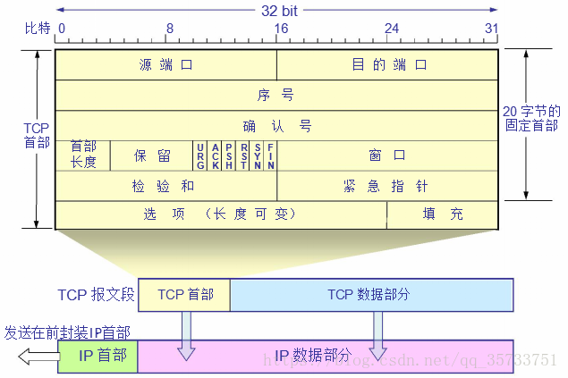

# TCP 协议

TCP 提供了一种可靠的面向连接的字节流运输层服务。TCP 将用户数据打包构成报文段，它发送数据后启动一个定时器，另一端对收到的数据进行确认，对失序的数据进行重新排序，丢弃重复数据；TCP 还提供了端到端的流量控制，并计算和验证一个强制性的端到端的校验和。

## TCP 首部

下图显示了 TCP 首部的数据格式，如果不计入任选字段，通常是 20 个字节，下面根据图中所示分别介绍：

- 第一行：
    - 源端口号：16 位，用于寻找发端应用程序
    - 目的端口号：16 位，用于寻找收端应用程序

这两个值加上 IP 首部的源 IP 地址和目的 IP 地址唯一确定一个 TCP 连接（即四元组），通常也将一个 IP 地址和一个端口号成为一个插口（socket）。这个术语最早出现在 RFC973 中；插口对（socket pair）即代表所说的四元组。

- 第二行：序号，32位，用来标识从 TCP 发端向 TCP 收端发送的数据字节流

序号表示在整个报文段中的第一个数据字节。如果将字节流看做是在两个应用程序之间的单向流动，则 TCP 会用序号对每个字节进行计数。序号是 32位无符号数，序号达到 2^32-1 后又从 0 开始。

当建立一个新的连接的时候，SYN 标志位变 1。序号字段包含由这个主机选择的该连接的初始序号 ISN（Initial Sequence Number），该主机要发送的第一个字节序号为 ISN + 1（因为 SYN 消耗了一个序号）。这里很好理解，当第一次建立连接的时候，客户端会发送 SYN 1 到服务端，假设ISN = 1， 则建立连接后，ISN = 1+1 =2。所以真正传输第一个字节的序号即为 ISN + 1。

- 第三行：确认序号，32位

确认序号包含发送确认的一端所期望收到的下一个序号。因此，确认序号应当是上次成功收到数据字节序号加1.只有 ACK 标志为 1 时，确认序号字段才有效。

- 第四行：
    - 首部长度：4 位，首部长度给出首部中 32 位字的数目。1111 转成十进制是 15，所以，TCP 首部最多可以有 15 * 4 = 60 个字节。然后如果没有任选字段，正常长度是 20 个字节。
    - 保留 6位：
    - 6个比特标志：
        - URG 紧急指针（urgent point）有效
        - ACK 确认序号有效
        - PSH 接收方应该尽快将整个报文段交给应用程序
        - RST 重建连接
        - SYN 同步序号用来发起一个连接
        - FIN 发端完成发送任务
    - 窗口大小： 16位，用来声明

- 第五行：
    - 校验和
    - 紧急指针

- 第六行：可选项，最多可以有 40 个字节
    - 最常见的可选字段是最长报文大小 MSS（Maximum Segment Size）。每个连接方通常都在通信的第一个报文段中指明整个选项。它指明本端所能接收的最大长度的报文段。
- 第七行：TCP 数据，这部分是可选的

## TCP 三次握手

### 三次握手过程中，服务端在客户端发送 ACK 的过程中断网了则么办

## TCP 四次挥手

## TCP ISN

## TCP 连接超时

## TCP MSS 最大报文长度

## TCP 半关闭

## TCP 状态迁移图

##　TCP 2MSL 等待状态

## TCP 复位报文段

## 滑动窗口
