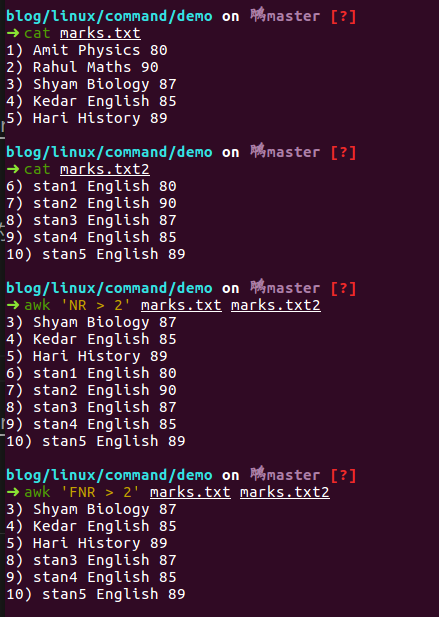

# linux 常用命令

本文总结或收集了一些 linux 常用命令的具体用法介绍，供忘记的时候做个参考。

## AWK

- [三十分钟学会AWK](https://github.com/mylxsw/growing-up/blob/master/doc/%E4%B8%89%E5%8D%81%E5%88%86%E9%92%9F%E5%AD%A6%E4%BC%9AAWK.md)

    补充说明：

    - `$0` 指的是一整行字符串，第一个字段是 `$1`。
    - `print` 的字符串拼接符是`空格`，所以如果想要打印空格，需要手动拼接 `" "`，同时一次 `print` 的结果会自带换行符。
    - 如果 awk 中指定了多个文件，`NR` 变量会把第二个文件的行号从第一个文件的行号末尾开始计数；而 `FNR` 变量会独立计算每个文件的行号，彼此不受影响。(在 ubuntu 16.04 下的测试结果)
    
    - 语句之间要加分号，例如：

    ```shell
    # 注意 if else 之间的分号，如果没有会报语法错误
    awk 'BEGIN{a=10; b = 20; if (a == b) print "a == b"; else print "a != b"}'
    a != b
    ```

    - awk 的字符串连接符是空格，不是加号：

        ```shell
        awk 'BEGIN { str1 = "Hello, "; str2 = "World"; str3 = str1 str2; print str3 }'
        Hello, World
        ```

    - awk 的数组中如果没有定义某个下标的元素，则序号不会被打印：

        ```shell
        ➜ awk 'BEGIN{arr[0]=1; arr[2]=10; for (i in arr) printf "arr[%d]: %d\n", i, arr[i]}'
        arr[0]: 1
        arr[2]: 10
        ```

    - 常见用例：

        ```shell
        # 统计第 3 列中每个值出现的次数
        cat files | awk '{a[$3]++} END {for (i in a) {print i, a[i] | "sort -k 2 -g -r"}}'
        # 统计一个文件中的空白行
        cat files | awk '/^$/{x++} END {print x}'
        # 查找替换
        # stanxing,1995.10.30 => tomxing,1995.10.30
        cat files | awk -F ',' '{gsub(/stan/,"tom",$0);print $0}'
        # 计算每行数字的平均数
        # value,1,2,3,4,5 => value 3
        cat files | awk -F ',' '{total=$2+$3+$4+$5+$6; avg=total/5}{print $1 " " total}'
        # 输出正则匹配的行
        # stanxing:pass
        # stanyang:rejected
        cat files | awk -F ':' '$0 ~ /stanxing/'
        # if 的使用方式，如果第一个字段等于 stanxing 就输出
        # stanxing,1995.10.30
        # stanyang,1995.10.30
        cat files | awk -F ',' '{if ($1 == "stanxing"){print}}'

        # 根据下面的用例输出对应的用例结果
        # 输入：
        # 100
        # a 100
        # b -50
        # c -20
        # 输出：
        # 100
        # a 100
        # 200
        # b -50
        # 150
        # c -20
        echo -e "100\na 100\nb -50\nc -20" | awk '{ if(NR==1) {sum=$1; print $1;} else if (NR == 4) {print $0;} else {sum+=$2; print $1" "$2"\n"sum;}}'

        # 根据输入用例输出对应的结果
        #输入：
        # 12334:13510014336
        # 12334:12343453453
        # 12099:13598989899
        # 12334:12345454545
        # 12099:12343454544
        # 输出：
        # [12334]
        # 13510014336
        # 12345454545
        # 12343453453
        # [12099]
        # 13598989899
        # 12343454544
        echo -e "12334:13510014336\n12334:12343453453\n12099:13598989899\n12334:12345454545\n12099:12343454544" | sort -r | \
            awk -F ':' '{a[$1]++; if (a[$1] == 1){print "["$1"]"; print $2;} else {print $2}}'
        ```

## SED

- [三十分钟学会SED](https://github.com/mylxsw/growing-up/blob/master/doc/%E4%B8%89%E5%8D%81%E5%88%86%E9%92%9F%E5%AD%A6%E4%BC%9ASED.md)

    补充说明：
    - 使用 `-r` 开启扩展的正则表达式语法，可以使用 `\1` 代表匹配到正则分组的值
    - 在字符串替换命令 s 中使用 `\u 和 \U`的结果是不一样的，`\u` 只会作用一个字符，`\U` 会作用匹配到的所有字符：

        ```shell
        echo -e "123abc456" | sed -n -r 's/[a-z]{3}/\u&/p' => 123Abc456
        echo -e "123abc456" | sed -r 's/[a-z]{3}/\U&/p' => 123ABC456
        ```

    - 常见用例：

        ```shell
        # 将文本中的小写字母转换成大写
        sed 's/[a-z]/\U&/g'
        # 将文本中的大写字母转换成小写
        sed 's/[A-Z]/\L&/g'
        # 将 123abc456 变成 456ABC123
        echo -e "123abc456" | sed -r 's#(...)(...)(...)#\3\U\2\1#g'
        # 删除文件每行的第一个字符
        sed 's/.//'
        sed -r 's/(.)(.*)/\2/'
        # 删除文件每行的第二个字符
        sed -r 's/(.)(.)(.*)/\1\3/'
        # 删除文件每行的倒数第二个字符
        sed -r 's/(.*)(.)(.)/\1/\3/'
        # 删除文件每行的第二个单词
        sed -r 's/(\w+) (\w+) (\w+)/\1 \3/'
        # 交换每行的第一个字符和第二个字符
        sed -r 's/(.)(.)(.*)/\2\1\3/'
        # 删除一个文件中所有的数字
        sed 's/[0-9]//g'
        # 删除每行开头的空格
        sed 's/^\s+//'
        # 用制表符替换空格
        sed 's/\s+/\t/g'
        # 把大写字母用括号括起来
        sed -r 's/([A-z])/\(\1)/g'
        # 隔行删除
        sed '0~2{=;d}'
        # 把文件第2行到4行的内容复制到第7行后面
        sed '2h; 3,4H; 7G'
        # 把文件第2行到4行的内容移动到第7行后面
        sed '2{h;d} 3,4{H;d}; 7G'
        # 去掉空行和以＃号开头的行
        sed -r '/(^$|^#)/d' 或者 sed -e '/^$/d' -e '/^#/d'
        ```

## tcpdump

- [tcpdump 简明教程](https://github.com/mylxsw/growing-up/blob/master/doc/tcpdump%E7%AE%80%E6%98%8E%E6%95%99%E7%A8%8B.md):

    - 补充说明：

    抓取 http 各请求方法的包，推荐使用 wireshark 的在线[Capture Filter Generator](https://www.wireshark.org/tools/string-cf.html)。对各条件内容的解释写在了注释里。

    ```shell
    # 过滤 GET 请求，含义解释如下：
    # tcp[12:1] 的意思是获取第 13 个字节，实际该字节内存的是 TCP 首部长度，但首部长度只占 4 位；`0xf0` 转换成二进制就是 11110000，与 tcpp[12:1] 做与运算相当于只保留前 4 位的值（也就是首部长度）。
    # 然后对其做右移 2 位的运算，实际上应该右移 4 位才能将前 4 位从高位移动到低位，但是由于 TCP 首部 4 位最大值为 15，但是单位是 4 字节，所以最大可以表示 60 个字节，右移 4 位后还需要再乘以 4，相当于右移两位了。这样计算出了整个 TCP 头部的偏移，下面就是数据报的内容了。
    # 最后再一次通过 tcp[((tcp[12:1] & 0xf0) >> 2):4] 意味着越过 TCP 首部获取数据报的前 4 个字节，对于 http 请求来说，其请求头的样式为 `GET /ping HTTP 1.1`, 前四个字节就是 `GET `（注意最后是一个空格）。
    # tcp[((tcp[12:1] & 0xf0) >> 2):4] = 0x47455420

    # 过滤 POST 请求，含义解释如下：
    # 整个含义是一样的，只不过 POST 请求的数据报要检查前五个字节，即 `POST `。但是 tcpdump 的语法字节偏移最大是 4，所以需要写两边。
    # tcp[((tcp[12:1] & 0xf0) >> 2):4] = 0x504f5354 && tcp[((tcp[12:1] & 0xf0) >> 2) + 4:1] = 0x20

    # 过滤 PUT 请求
    # tcp[((tcp[12:1] & 0xf0) >> 2):4] = 0x50555420
    # 过滤 DELETE 请求
    # tcp[((tcp[12:1] & 0xf0) >> 2):4] = 0x44454c45 && tcp[((tcp[12:1] & 0xf0) >> 2) + 4:2] = 0x5445 && tcp[((tcp[12:1] & 0xf0) >> 2) + 6:1] = 0x20
    # 过滤 HEAD 请求
    # tcp[((tcp[12:1] & 0xf0) >> 2):4] = 0x48454144 && tcp[((tcp[12:1] & 0xf0) >> 2) + 4:1] = 0x20

    # 过滤 HTTP 1.x 的响应，含义解释如下：
    # 原理也基本一样，只是 http 响应头的格式为 `HTTP/1.1 200 OK`，只需要过滤 `HTTP/1.`这几个字节（因为版本号不固定嘛）
    # tcp[((tcp[12:1] & 0xf0) >> 2):4] = 0x48545450 && tcp[((tcp[12:1] & 0xf0) >> 2) + 4:2] = 0x2f31 && tcp[((tcp[12:1] & 0xf0) >> 2) + 6:1] = 0x2e

    tcpdump -Avvvn "tcp[((tcp[12:1] & 0xf0) >> 2):4] = 0x47455420
            || (tcp[((tcp[12:1] & 0xf0) >> 2):4] = 0x504f5354 && tcp[((tcp[12:1] & 0xf0) >> 2) + 4:1] = 0x20)
            || (tcp[((tcp[12:1] & 0xf0) >> 2):4] = 0x50555420)
            || (tcp[((tcp[12:1] & 0xf0) >> 2):4] = 0x44454c45 && tcp[((tcp[12:1] & 0xf0) >> 2) + 4:2] = 0x5445 && tcp[((tcp[12:1] & 0xf0) >> 2) + 6:1] = 0x20)
            || (tcp[((tcp[12:1] & 0xf0) >> 2):4] = 0x48454144 && tcp[((tcp[12:1] & 0xf0) >> 2) + 4:1] = 0x20)
            || (tcp[((tcp[12:1] & 0xf0) >> 2):4] = 0x48545450 && tcp[((tcp[12:1] & 0xf0) >> 2) + 4:2] = 0x2f31 && tcp[((tcp[12:1] & 0xf0) >> 2) + 6:1] = 0x2e)"
    ```
